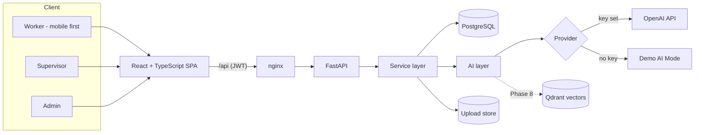
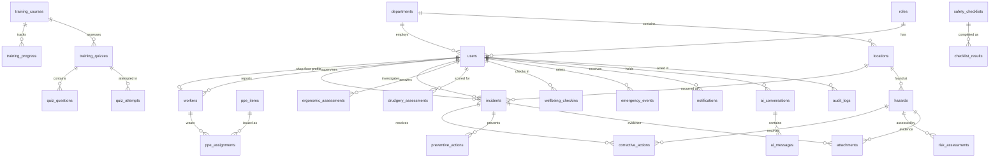

# SafeOps: Architecture and Implementation Plan

Final-year project: **Occupational Health and Safety: Reducing Drudgery and Enhancing Worker Safety**.

This document is the working plan for the build. It records the architecture decisions, the data model, how AI is kept safe and testable, and what each of the ten phases delivers and how it is verified.

## 1. System overview



**Layering rule.** Routes validate input and check permissions, services hold business logic, the AI layer holds every prompt and model call. Routes never call an LLM directly, and services never trust raw LLM text: every AI output is parsed into a Pydantic model before it is used or stored.

## 2. Key decisions

| Decision | Choice | Why |
|---|---|---|
| Enum storage | `VARCHAR` + `CHECK` constraint (not native PG enums) | Adding a hazard category later is a one-line migration instead of an `ALTER TYPE` dance; the same migrations run on SQLite for fast tests. |
| Auth | Stateless JWT (HS256), bcrypt (cost 12) | Simple to run, no session store. Deactivating a user takes effect on the next request because every request re-loads the user. |
| Self-registration | Workers active immediately; supervisors need admin approval; admins can't self-register | Registration asks for a role, so without this anyone could register as a supervisor and see every worker's reports. |
| Password reset | Signed 30-min token bound to the current password hash | Single-use without a token table: once the password changes, the fingerprint no longer matches. |
| Anonymous hazards | `reporter_id` is stored as `NULL`, not hidden in the UI | Anonymity that only exists in the UI isn't anonymity. |
| Multilingual reports | Keep `original_description` + `original_language` alongside the English text | Investigators can check the translation against the worker's own words. |
| AI outputs | Stored as JSON in `ai_analysis` next to the human-entered fields | The human record stays authoritative; the AI suggestion is kept for audit and can be compared to what was decided. |
| Location model | `departments` → `locations` with grid coordinates | Gives the heatmap a real spatial unit instead of free-text strings. |
| Rate limiting | In-process sliding window | Enough for one API instance; the interface allows swapping to Redis. |

## 3. Data model

30 tables, created by one Alembic migration (`backend/alembic/versions/…_0001_initial_schema.py`). All foreign keys and indexes are named deterministically.



Beyond the 24 tables the brief lists, the schema adds `locations` (heatmap unit), `attachments` (evidence files under opaque keys), `wellbeing_checkins` (section 23), `worker_feedback` (section 54) and `knowledge_documents` (RAG, section 51).

**Incident workflow** (`incidents.status`): `reported → assigned → investigating → corrective_action → verification → closed`. Transitions will be enforced in the service layer (Phase 3), not just in the UI.

**Risk score**: `risk_assessments.risk_score = likelihood × severity_score` (each 1–5). Bands: 1–4 Low, 5–9 Moderate, 10–16 High, 20–25 Critical. Calculated server-side, never by the LLM.

**Drudgery score**: seven factors (repetition, load, duration, posture, frequency, vibration, recovery time), each 1–5, weighted to 0–100. Weights live in configuration so they can be justified and tuned in the report. Low < 40 ≤ Moderate < 70 ≤ High.

## 4. AI architecture (Phase 4 onward)

```
backend/app/ai/
  provider.py            # LLMProvider protocol: complete_json(system, user, schema) -> BaseModel
  openai_provider.py     # structured outputs via response_format=json_schema
  demo_provider.py       # deterministic rule-based outputs, every response flagged demo_mode=True
  guardrails.py          # emergency / medical classifier, banned-claim checks, standard escalation text
  prompts/               # versioned prompt templates, one per task
  incident_analyzer.py  hazard_classifier.py  risk_assessor.py  safety_assistant.py
  root_cause.py  training_generator.py  safety_insights.py  ergonomic_analyzer.py
```

The rules from section 34 are enforced in code, not only in prompts:

1. **Classify before answering.** Every SafeAssist message is first labelled `emergency`, `medical_concern` or `safety_guidance`. Emergency answers always lead with the fixed escalation sentence from the brief and the in-app emergency procedure.
2. **Numbers come from the database.** The supervisor copilot fetches statistics through service functions and passes them to the model as data. The model writes the explanation; it never computes counts. Answers show which queries fed them.
3. **No invented contacts or regulations.** Emergency contacts come only from organisation settings. If none are configured the UI says so instead of showing a number.
4. **Labelled uncertainty.** Every AI output is rendered with an "AI suggestion, verify before acting" marker, and root-cause output is explicitly marked as suggestions requiring human verification.
5. **Demo AI Mode.** With no API key, a deterministic provider returns structured, clearly labelled outputs so the full workflow can be demonstrated offline. The header badge shows which mode is active.

## 5. Security model

- bcrypt password hashing; JWT with expiry; "keep me signed in" extends lifetime (14 days) and switches storage from `sessionStorage` to `localStorage`.
- Role guard `require_roles(...)` on every protected route. The frontend guard only improves UX; the API is the enforcement point (covered by tests).
- Login attempts are rate limited per IP and failures are audit-logged; login errors don't reveal whether an email exists; forgot-password gives the same response for every email.
- Pydantic validation on all inputs, flattened into `{field: message}` so forms show errors inline; ORM-only queries; CORS restricted to configured origins; API key only ever read server-side.
- Uploads (Phase 2): extension and MIME allow-list, size limit, magic-byte sniffing, files stored under random keys and served only through an authorised endpoint.

## 6. Implementation plan

Each phase ends with passing tests and a clean `docker compose up`. Nothing is added to the navigation until it works end to end.

| Phase | Delivers | Done when |
|---|---|---|
| **1. Foundation** ✅ | Monorepo, 30-table schema + migration, seed data (41 users, 6 departments, 16 locations), JWT auth, RBAC, registration with approval, password reset, audit log, user management, app shell, dark mode, Docker | 22 backend + 4 frontend tests pass; migrations verified on PostgreSQL 16 |
| **2. Worker reporting** | Landing page, worker dashboard (safety score, quick actions), incident and hazard reporting with photo upload, anonymous hazards, emergency mode, notifications, seed history of 20+ incidents and hazards | A worker can report from a phone and the supervisor gets a notification |
| **3. Supervisor & admin** | Incident board and workflow, assignment, CAPA with due dates and overdue status, KPI dashboards, filters, global search, audit log viewer | Full reported → closed lifecycle works with the right permissions at each step |
| **4. AI services** | Provider abstraction, guardrails, SafeAssist chat with history, AI incident structuring, hazard classification, 5-Whys root-cause suggestions, AI rate limiting | Every AI endpoint has schema-validation tests and works in Demo AI Mode |
| **5. Risk & drudgery** | Risk assessment with interactive 5×5 matrix, hierarchy-of-controls view, ergonomic questionnaire, drudgery score, fatigue check-in | Scores are deterministic and unit-tested; AI only adds explanations |
| **6. Training, PPE, checklists** | Courses, AI quiz generation, quiz attempts and certificates, PPE assignments and compliance, configurable checklists that suggest a hazard report on "No" | Compliance numbers on dashboards come from these tables |
| **7. Analytics & reports** | Trend detection, safety heatmap, AI safety intelligence report, supervisor copilot over real data, monthly PDF/CSV export | Every chart is backed by a tested query |
| **8. Knowledge base** | Document upload, chunking, embeddings in Qdrant, SafeAssist answers with source citations, document summaries | Answers cite the SOP section, or say plainly that no company source was found |
| **9. Hardening** | Performance (pagination, indexes, lazy loading), accessibility pass, security review, broader test coverage | Lighthouse accessibility ≥ 95 on worker screens |
| **10. Documentation & demo** | Project report sections (use-case, DFD, sequence diagrams, test cases, results), screenshots, scripted demo flow | Demo runs start to finish from a fresh `docker compose up` |

## 7. API map

| Prefix | Status | Notes |
|---|---|---|
| `/api/health`, `/api/system/info` | Phase 1 | Health check; runtime flags such as Demo AI Mode |
| `/api/auth` | Phase 1 | login, register, me, logout, forgot/reset password, departments |
| `/api/users` | Phase 1 | Admin only: list/search/filter/paginate, create, update role/department/active |
| `/api/incidents`, `/api/hazards`, `/api/emergency`, `/api/notifications` | Phase 2 | |
| `/api/corrective-actions`, `/api/workers`, `/api/analytics` | Phase 3 | |
| `/api/ai` | Phase 4 | Rate limited per user |
| `/api/risk-assessments`, `/api/ergonomics`, `/api/drudgery` | Phase 5 | |
| `/api/training`, `/api/ppe`, `/api/checklists` | Phase 6 | |

Interactive documentation: `http://localhost:8000/api/docs`.
