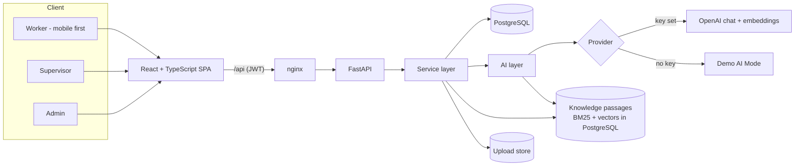
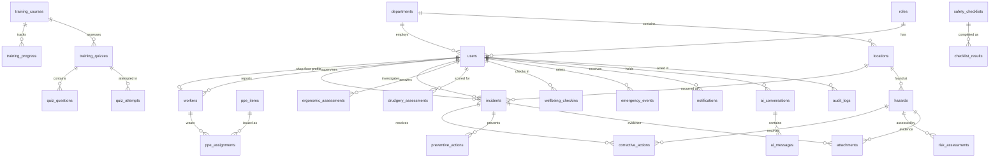

# SafeOps: Architecture and Implementation Plan

Final-year project: **Occupational Health and Safety: Reducing Drudgery and Enhancing Worker Safety**.

This document is the working plan for the build. It records the architecture decisions, the data model, how AI is kept safe and testable, and what each of the ten phases delivers and how it is verified.

## 1. System overview



**Layering rule.** Routes validate input and check permissions, services hold business logic, the AI layer holds every prompt and model call. Routes never call an LLM directly, and services never trust raw LLM text: every AI output is parsed into a Pydantic model before it is used or stored.

## 2. Key decisions

| Decision | Choice | Why |
|---|---|---|
| Enum storage | `VARCHAR` + `CHECK` constraint (not native PG enums) | Adding a hazard category later is a one-line migration instead of an `ALTER TYPE` dance; the same migrations run on SQLite for fast tests. |
| Auth | Stateless JWT (HS256), bcrypt (cost 12) | Simple to run, no session store. Deactivating a user takes effect on the next request because every request re-loads the user. |
| Self-registration | Workers active immediately; supervisors need admin approval; admins can't self-register | Registration asks for a role, so without this anyone could register as a supervisor and see every worker's reports. |
| Password reset | Signed 30-min token bound to the current password hash | Single-use without a token table: once the password changes, the fingerprint no longer matches. |
| Anonymous hazards | `reporter_id` is stored as `NULL`, not hidden in the UI | Anonymity that only exists in the UI isn't anonymity. |
| Multilingual reports | Keep `original_description` + `original_language` alongside the English text | Investigators can check the translation against the worker's own words. |
| AI outputs | Stored as JSON in `ai_analysis` next to the human-entered fields | The human record stays authoritative; the AI suggestion is kept for audit and can be compared to what was decided. |
| Location model | `departments` → `locations` with grid coordinates | Gives the heatmap a real spatial unit instead of free-text strings. |
| Rate limiting | In-process sliding window | Enough for one API instance; the interface allows swapping to Redis. |

## 3. Data model

35 tables, created by four Alembic migrations: `0001` initial schema (30 tables), `0002` profiles, departments and emergency (health checks, work history, emergency responses and contacts), `0003` CAPA completion notes, `0004` risk, wellbeing and knowledge (knowledge passages, document files). All foreign keys and indexes are named deterministically. The diagram below shows the core of the Phase 1 schema.



Beyond the 24 tables the brief lists, the schema adds `locations` (heatmap unit), `attachments` (evidence files under opaque keys), `wellbeing_checkins` (section 23), `worker_feedback` (section 54) and `knowledge_documents` (RAG, section 51).

**Incident workflow** (`incidents.status`): `reported → assigned → investigating → corrective_action → verification → closed`. Transitions are enforced in the service layer, not just in the UI, together with the CAPA gates (no verification until every corrective action is complete).

**Risk score**: `risk_assessments.risk_score = likelihood × severity_score` (each 1–5). Bands: 1–4 Low, 5–9 Moderate, 10–16 High, 20–25 Critical. Calculated server-side, never by the LLM.

**Drudgery score**: seven factors (repetition, load, duration, posture, frequency, vibration, recovery time), each 1–5, weighted to 0–100. Weights live in configuration so they can be justified and tuned in the report. Low < 40 ≤ Moderate < 70 ≤ High.

## 4. AI architecture

```
backend/app/ai/
  provider.py            # provider abstraction; Demo provider when no OPENAI_API_KEY
  openai_provider.py     # JSON-schema structured outputs, chat, embeddings (text-embedding-3-small)
  service.py             # every AI task: report suggestions, SafeAssist, 5 Whys, risk explanation,
                         #   quiz drafts, monthly summary, data copilot, document summaries
  schemas.py             # Pydantic schemas every model output is validated against
  guardrails.py          # emergency / medical classifier, phone-number stripping, escalation text
  demo.py  knowledge.py  root_cause_demo.py   # deterministic Demo AI Mode outputs, four languages
backend/app/services/knowledge_base.py        # document extraction, sectioning, BM25 + vector search, citations
```

**Company documents (Phase 8).** The original plan used Qdrant. At this scale (hundreds of documents) passages and their embeddings are stored in PostgreSQL (`knowledge_chunks`) and ranked with BM25, blended with cosine similarity when live AI is on. This removes a service, keeps search working offline, and keeps citations transactional with the documents. A passage is only cited if it covers at least half of the question's distinct words (and at least two), so unrelated SOPs are never presented as sources.

The rules from section 34 are enforced in code, not only in prompts:

1. **Classify before answering.** Every SafeAssist message is first labelled `emergency`, `medical_concern` or `safety_guidance`. Emergency answers always lead with the fixed escalation sentence from the brief and the in-app emergency procedure.
2. **Numbers come from the database.** The supervisor copilot fetches statistics through service functions and passes them to the model as data. The model writes the explanation; it never computes counts. Answers show which queries fed them.
3. **No invented contacts or regulations.** Emergency contacts come only from organisation settings. If none are configured the UI says so instead of showing a number.
4. **Labelled uncertainty.** Every AI output is rendered with an "AI suggestion, verify before acting" marker, and root-cause output is explicitly marked as suggestions requiring human verification.
5. **Demo AI Mode.** With no API key, a deterministic provider returns structured, clearly labelled outputs so the full workflow can be demonstrated offline. The header badge shows which mode is active.

## 5. Security model

- bcrypt password hashing; JWT with expiry; "keep me signed in" extends lifetime (14 days) and switches storage from `sessionStorage` to `localStorage`.
- Role guard `require_roles(...)` on every protected route. The frontend guard only improves UX; the API is the enforcement point (covered by tests).
- Login attempts are rate limited per IP and failures are audit-logged; login errors don't reveal whether an email exists; forgot-password gives the same response for every email.
- Pydantic validation on all inputs, flattened into `{field: message}` so forms show errors inline; ORM-only queries; CORS restricted to configured origins; API key only ever read server-side.
- Uploads: size limit, magic-byte sniffing (name and declared type ignored), photos decoded and re-encoded to strip EXIF/GPS, voice notes and documents type-checked, files stored under random keys and served only through an authorised endpoint with `nosniff`.
- Phase 9: a parametrised test calls every protected route (118) without a token and expects 401; production refuses a default or short `JWT_SECRET_KEY`; nginx sends a strict Content-Security-Policy (inline theme script allowed by SHA-256 hash, verified by a test), `X-Frame-Options: DENY`, `Referrer-Policy` and a `Permissions-Policy` allowing only microphone and camera; CSV exports neutralise spreadsheet formulas.

## 6. Reporting design (Phase 2)

**Notification routing.** Every report notifies the supervisors of the report's department plus the reporter's own supervisor. High or critical severity, or any injury, also notifies every admin. A report with no department goes to admins so it can't be missed. The reporter gets a "report received" notification, except for anonymous hazards.

**Anonymity.** For an anonymous hazard, `reporter_id`, `attachments.uploaded_by`, and the audit log's `user_id` and `ip_address` are all stored as `NULL`, and notifications say "reported anonymously". Photo metadata is stripped from every upload, which matters most here. The worker gets a reference number but can't see the report in their own list, because nothing links it to them.

**Photo pipeline.** Count → size → magic-byte sniff (JPEG/PNG/WebP) → full Pillow decode with a pixel cap (against decompression bombs) → EXIF orientation applied → downscale to 2048 px → re-encode without metadata → store as `<random hex>.<ext>`. Every photo is validated before anything is written, so one bad file rejects the whole report cleanly.

**Safety score.** A weighted average of components a worker can check for themselves: PPE compliance (assigned items in date and passing inspection) and mandatory training (current certificates), and daily checklist completion over the last 7 days (added in Phase 6), weighted equally. A component with nothing to measure is left out and the weights re-normalised, rather than scored as 0 or 100. Bands: 85 and above is good, 60 and above is fair, otherwise needs attention.

**Emergency mode.** Guidance is fixed, general text (raise the alarm, get clear, call trained help), never medical treatment advice. Contacts come only from `EMERGENCY_CONTACTS` and real user records.

## 7. Implementation plan

Each phase ends with passing tests and a clean `docker compose up`. Nothing is added to the navigation until it works end to end.

| Phase | Delivers | Done when |
|---|---|---|
| **1. Foundation** ✅ | Monorepo, 30-table schema + migration, seed data (41 users, 6 departments, 16 locations), JWT auth, RBAC, registration with approval, password reset, audit log, user management, app shell, dark mode, Docker | 22 backend + 4 frontend tests pass; migrations verified on PostgreSQL 16 |
| **2. Worker reporting** ✅ | Landing page, worker dashboard (safety score, quick actions), incident and hazard reporting with photo upload, anonymous hazards, emergency mode, notifications, seed history of 20+ incidents and hazards | 52 backend + 9 frontend tests pass; report-to-notification flow verified on PostgreSQL through nginx |
| **3. Supervisor & admin** ✅ | Incident board, workflow with assignment, CAPA (corrective and preventive actions with owners, due dates, derived overdue status, notifications, "My actions"), workflow gates (no verification until every corrective action is done; no "controlled" hazard with open actions), supervisor and admin KPI dashboards, report filters (type, department, dates, assigned to me), global search (Ctrl+K), audit log viewer | 109 backend + 18 frontend tests pass; reported → closed lifecycle verified on PostgreSQL through nginx, migrations 0002–0003 verified (upgrade, downgrade, upgrade) |
| **4. AI services** ✅ | Provider abstraction, guardrails, SafeAssist chat with history, AI incident structuring, hazard classification, 5 Whys root-cause suggestions with one-click actions, risk explanations, quiz drafts, embeddings, AI rate limiting | Every AI output schema-validated with tested fallbacks; all features work in Demo AI Mode |
| **5. Risk & drudgery** ✅ | Risk register with interactive 5×5 matrix and hierarchy of controls, ergonomics questionnaire, seven-factor drudgery score with configurable weights, daily fatigue check-in, supervisor workload & fatigue view | Scores deterministic and unit-tested; AI only explains; migration 0004 verified |
| **6. Training, PPE, checklists** ✅ | 8 courses with lessons, server-marked quizzes and certificates, AI quiz drafts reviewed by staff, PPE issue/inspect/report-damage and compliance, daily checklists; safety score now includes checklists | Dashboard compliance numbers come from these tables |
| **7. Analytics & reports** ✅ | Monthly trends, rising-category signal, location heatmap, data copilot that lists its sources, monthly report (print to PDF), CSV export with formula-injection protection | Every figure backed by a tested query |
| **8. Knowledge base** ✅ | PDF/text/Markdown upload, sectioning, BM25 + embeddings in PostgreSQL, SafeAssist citations linking to the section, document summaries, 3 demo SOPs | Answers cite the SOP section, or say plainly that no company source was found |
| **9. Hardening** ✅ | Route-auth test over all endpoints, production secret check, CSP and security headers, axe tests, contrast tokens, lazy-loaded dictionaries and vendor split (main bundle 748 → 200 KB) | Lighthouse accessibility **100** on every screen, light and dark |
| **10. Documentation & demo** ✅ | [Project report material](PROJECT_REPORT.md) (use-case, DFD, sequence diagrams, test cases, results), [screenshots](screenshots/), [demo script](DEMO.md) | 277 backend + 28 frontend tests pass; demo runs from a fresh `docker compose up` |

## 8. API map

| Prefix | Status | Notes |
|---|---|---|
| `/api/health`, `/api/system/info` | Phase 1 | Health check; runtime flags such as Demo AI Mode |
| `/api/auth` | Phase 1 | login, register, me, logout, forgot/reset password, departments |
| `/api/users` | Phase 1 | Admin only: list/search/filter/paginate, create, update role/department/active |
| `/api/incidents`, `/api/hazards` | Phase 2 | Create (multipart: `payload` JSON + up to 3 `photos`), list with filters and search, detail. Scoped by role. |
| `/api/attachments/{id}` | Phase 2 | Evidence download, same visibility as the parent report |
| `/api/notifications` | Phase 2 | List, unread count, mark read, mark all read |
| `/api/emergency`, `/api/emergency/alert` | Phase 2 | Guidance and configured contacts; critical alert (5 per minute per user) |
| `/api/locations`, `/api/dashboard/worker` | Phase 2 | Location picker data; safety score with breakdown, PPE, training, recent reports |
| `/api/actions` | Phase 3 | CAPA: list (mine / team, open / overdue / done), create, update progress, delete; `/api/actions/people` lists who an action can be given to |
| `/api/incidents/board`, `/api/dashboard/supervisor`, `/api/dashboard/admin` | Phase 3 | Workflow board cards; KPI dashboards |
| `/api/search`, `/api/audit` | Phase 3 | Global search within each user's visibility; admin-only audit log with filters |
| `/api/people`, `/api/departments`, `/api/emergency/active` | Added | Profiles, health checks and team management; department profiles; site-wide alarm and roll call |
| `/api/ai`, `/api/incidents/{id}/root-cause` | Phase 4 | SafeAssist chat, report suggestions, 5 Whys suggestion and recorded cause. Rate limited per user. |
| `/api/risk-assessments`, `/api/ergonomics`, `/api/drudgery`, `/api/wellbeing` | Phase 5 | Risk register (+ `/explain`), ergonomics, drudgery (+ `/weights`), daily check-in and team fatigue |
| `/api/training`, `/api/ppe`, `/api/checklists` | Phase 6 | Courses, quiz attempts, certificates, AI quiz drafts; PPE issue, inspect, report damage; checklist runs |
| `/api/analytics` | Phase 7 | Trends, heatmap, monthly report, copilot, `export/{kind}.csv` |
| `/api/knowledge` | Phase 8 | Upload and delete (admins), list, search, document detail with summary and passages |

125 API routes in total; everything except health, system info and the sign-in/registration/password-reset endpoints requires a token.

Interactive documentation: `http://localhost:8000/api/docs`.
