# SafeOps: 15-minute demo script

A walkthrough for a project review or viva. It follows one story: a worker reports, the team acts, management sees the result. Every step works offline in **Demo AI Mode** (no API key needed).

**Before you start**

```bash
docker compose up --build -d      # first run seeds the demo data
```

Open <http://localhost:8080>. All accounts use the password **`Demo@1234`**, and the login page has one-click buttons for the three main ones.

| Role | Email | Use it for |
|---|---|---|
| Worker | worker@demo.com | Reporting, siren, checklists, training, check-in, SafeAssist |
| Worker (second phone) | worker20@demo.com | Raising the alarm so the first worker receives it |
| Supervisor | supervisor@demo.com | Triage, root cause, CAPA, risk, workload, roll call |
| Admin | admin@demo.com | Overview, analytics, monthly report, documents, audit log |

Tip: open the worker in a normal window and the supervisor in a private window (or another browser) so both stay signed in. For the phone view, use DevTools device mode at 390 px wide.

---

## 1. Worker: report in your own language (3 min)

1. Sign in as **worker@demo.com**. Point out the safety score (**93** = PPE 80%, training 100%, checklists 100%) and the overdue glove replacement. 
2. Switch the language panel to **हिन्दी** or **मराठी**. The whole app changes, and the preference is saved to the profile. 
3. **Report hazard**: type a description in Marathi or Hindi (for example *"गोदाम B मध्ये तेल सांडले आहे, लोक घसरू शकतात"*), add a photo and press the microphone to record a voice note. Tick **Report anonymously**.
   - The form never asks which language you wrote in; it is detected.
   - Press **Suggest from my description** to see the AI propose type and severity, then **Use this** to apply them; you can still change them. 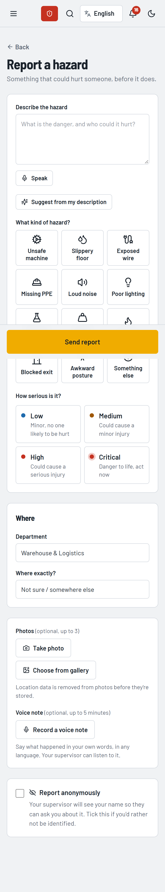
4. Submit and show the reference number (HAZ-2026-…).

## 2. Worker: daily safety (2 min)

1. **Checklists** → start today's pre-shift check, mark one item "Not OK" with a note. 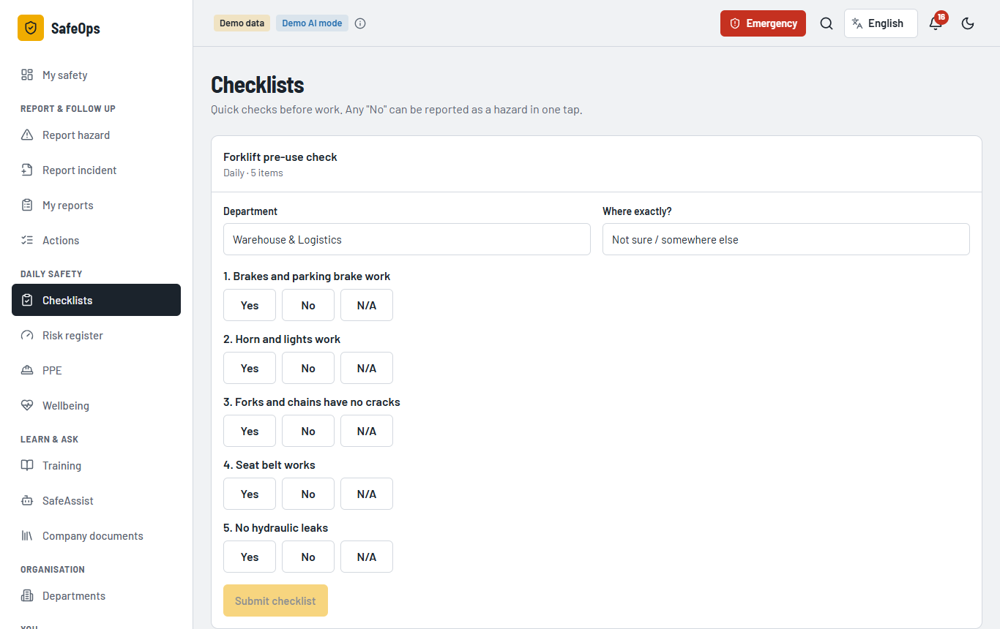
2. **Training** → Fire Safety Essentials → take the quiz. Marking happens on the server; a pass gives a printable certificate. 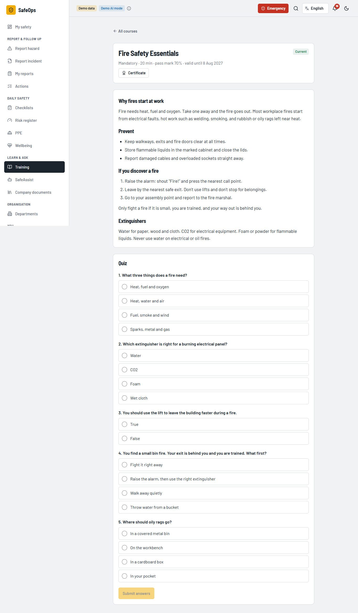
3. **Wellbeing** → do the 30-second check-in (sleep, fatigue, pain). A high pain score suggests seeing a first aider before anything else. 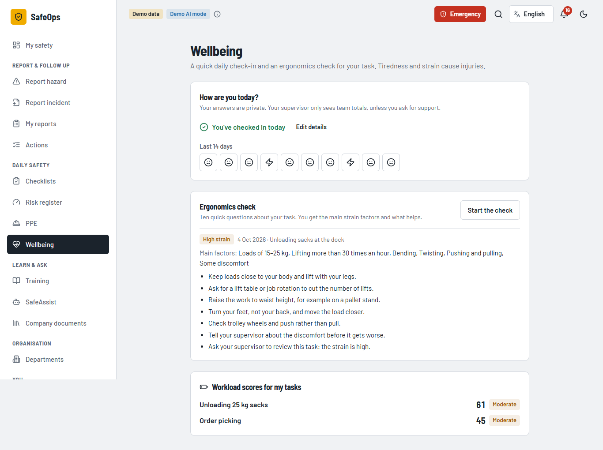
4. **SafeAssist** → ask *"What should I do with a small chemical spill?"* The answer cites **Chemical Spill Response SOP**, with a link to the exact section. Then ask *"I smell gas"* to show that the guardrail gives the fixed emergency response without calling a model. 

## 3. Emergency: alarm on every phone (3 min)

1. In the worker window, open **Emergency** to show the national numbers (112 / 100 / 101 / 108) and site contacts. 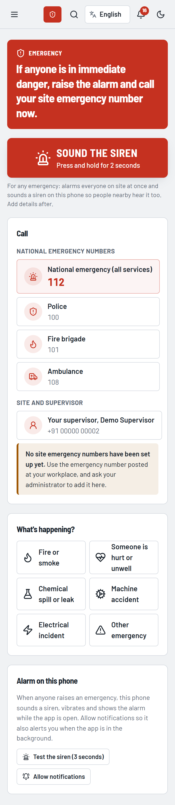
2. In a third window sign in as **worker20@demo.com**, **hold the red siren button for 2 seconds** (a tap does nothing, which avoids false alarms) and choose **Fire**.
3. Within 10 seconds the first worker's screen shows the full-screen alarm with siren and vibration. Press **I'm safe**. 
4. In the supervisor window, open **Emergency → Roll call** to see who is safe, who needs help and who hasn't answered. 
5. **End emergency for everyone** with a note. The alarm stops for everyone and an "all clear" arrives. A critical follow-up incident was created automatically.

## 4. Supervisor: investigate and fix (4 min)

1. **Home** shows the team's open reports, overdue actions and fatigue flags. 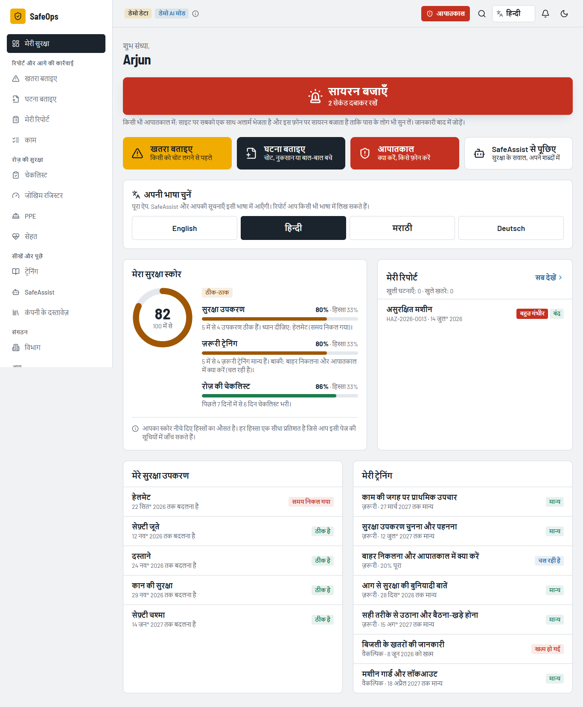
2. **Incident board** shows every incident by stage, so stuck items are visible. 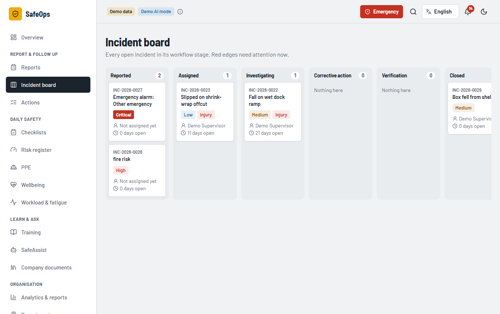
3. Open an incident in *Corrective action*:
   - **Suggest a root cause** gives an AI 5 Whys draft with suggested actions ranked by the hierarchy of controls.
   - Press **Add as action** on one suggestion, then **Use as starting point** and record the cause in your own words.
   - Try moving the incident to **Verification** while the action is open: it is refused. Mark the action done with a note, and it is allowed. 
4. **Risk** → new assessment: likelihood 4 × severity 5 = **20, critical**. The score is computed by the server; press **Explain** for a plain-language explanation. 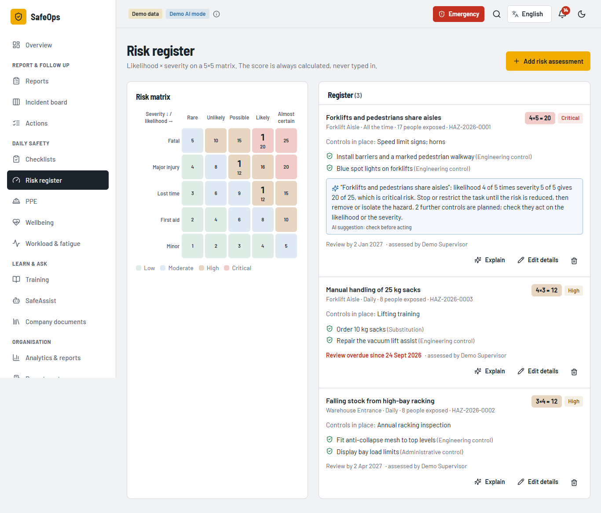
5. **Workload & fatigue** shows drudgery scores (seven weighted factors, 0–100) and who has reported high fatigue several days running. 

## 5. Admin: the whole picture (3 min)

1. **Overview** shows organisation KPIs, department comparison and overdue CAPA. 
2. **Analytics** shows monthly trends, the rising-category signal and the location heatmap (numbers printed in every cell). 
3. **Analytics → Ask the data** → *"Which actions are overdue?"* The answer lists the query it ran and the records it used, so nothing is invented. 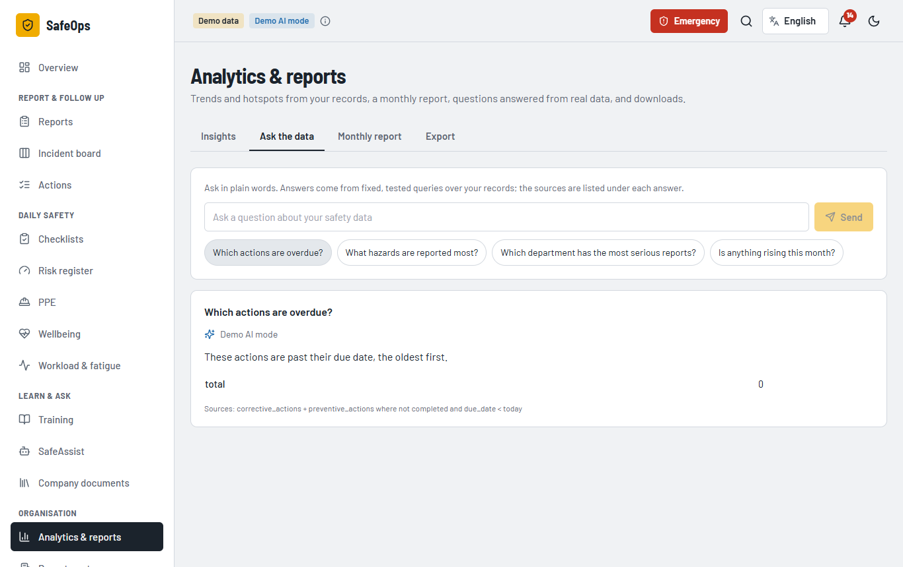
4. **Analytics → Monthly report**: a generated summary that prints to PDF from the browser. Also show the **Export** tab (CSV). 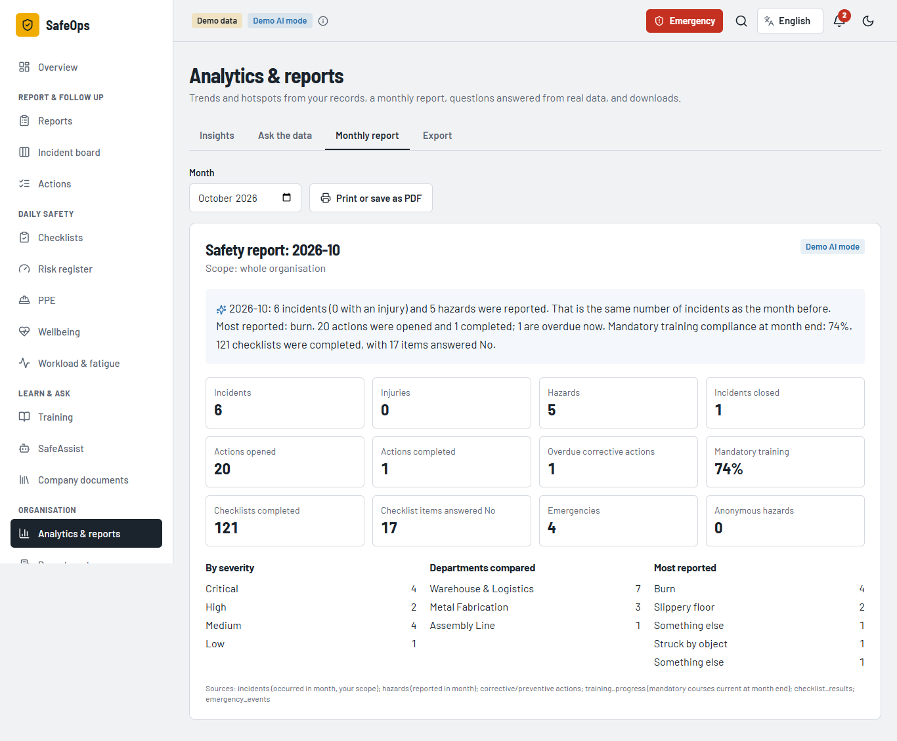
5. **Company documents** → upload a PDF or text SOP. It is split into sections and immediately used by SafeAssist. 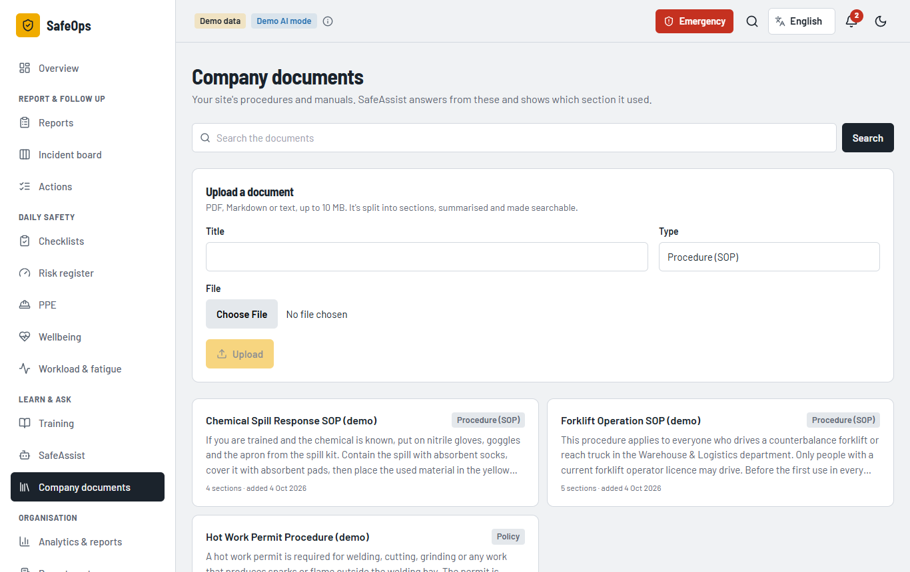
6. **Audit log** shows every change made during the demo, with who made it and when (anonymous reports show no one). 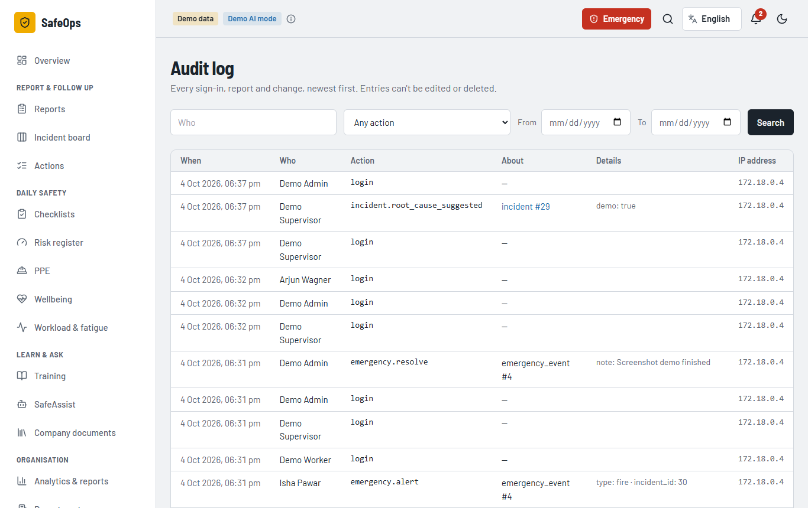

---

## Questions examiners often ask

| Question | Short answer |
|---|---|
| What if the AI is wrong? | It only suggests. People confirm every field, root cause and quiz; outputs are schema-validated; scores are computed by tested code. |
| What if there's no internet / API key? | Demo AI Mode: deterministic, offline, labelled on screen. Everything in this script works. |
| How is the alarm delivered? | Each signed-in app polls every 10 s; the alarm plays a generated siren and vibrates. Phones with the app fully closed would need web push (listed as future work). |
| Is anonymous reporting really anonymous? | No reporter, uploader, audit user or IP is stored, which is tested. Photos have EXIF/GPS removed; the form warns that a voice can identify you. |
| How is it secured? | JWT + role checks on every route (a test calls all 118 protected endpoints without a token), strict CSP, upload signature checks, CSV-injection protection, audit log. |

## Resetting the demo

Demo activity (test reports, emergencies) stays in the database. To start clean:

```bash
docker compose down -v && docker compose up --build -d
```

This **deletes all data** in the local database and re-seeds it.
