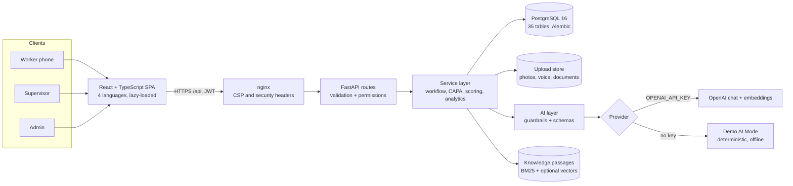
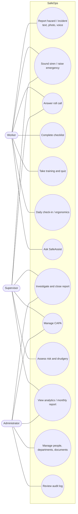
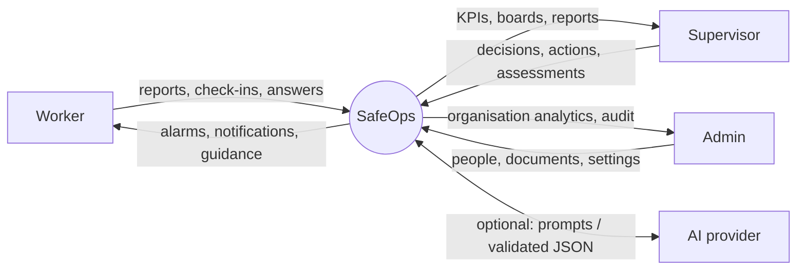
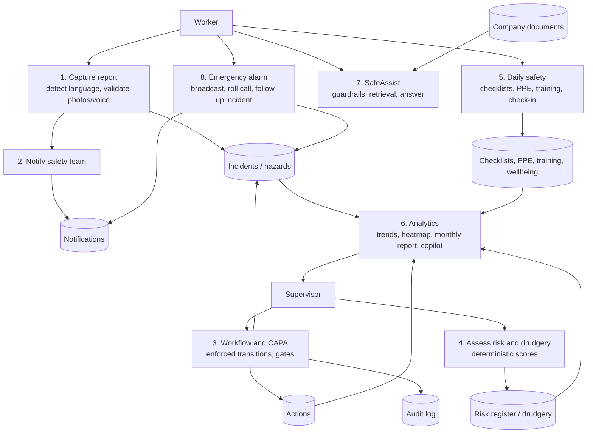
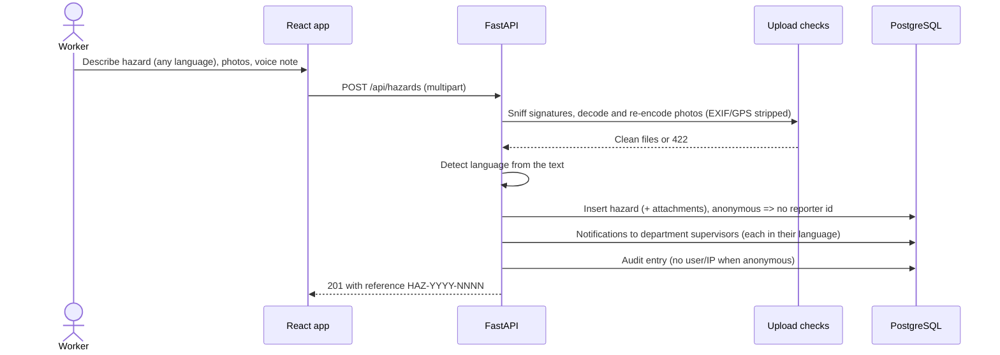
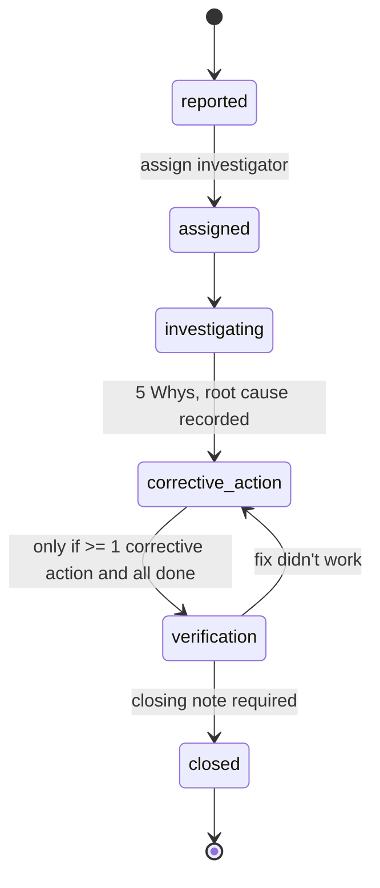

# SafeOps: Project Report Material

**Project:** Occupational Health and Safety: Reducing Drudgery and Enhancing Worker Safety
**System:** SafeOps, a multilingual, AI-assisted OHS platform for factory and warehouse workers, supervisors and safety administrators.

This document collects the material for the written report: the problem, the design, the diagrams, the test cases and the measured results. Every diagram is Mermaid, so it renders on GitHub and can be exported as an image for the report. Screenshots are in [`docs/screenshots/`](screenshots/).

---

## 1. Abstract

Workplace injuries in manufacturing and logistics are under-reported, followed up slowly, and the physical strain behind many of them (drudgery) is rarely measured. SafeOps lets any worker report a hazard or incident from a phone in under a minute, by text, photo or voice note, in English, Hindi, Marathi or German, without being asked which language they wrote in. Reports move through an enforced workflow to verified closure with corrective and preventive actions (CAPA). The platform quantifies risk (5×5 likelihood × severity) and drudgery (a seven-factor weighted score), runs daily checklists, training with quizzes and certificates, PPE tracking and a fatigue check-in, and gives supervisors and administrators trends, a location heatmap, a monthly report and a data copilot. A site-wide emergency alarm sounds on every signed-in phone and runs a live roll call.

AI assists throughout (structuring and classifying reports, 5 Whys root-cause suggestions, quiz generation, answers grounded in company SOPs with citations) but never decides: every number is computed by tested code, every AI output is validated against a schema and labelled as a suggestion, and emergencies and medical concerns are detected in code before any model is consulted. With no API key the whole system runs offline in a clearly labelled Demo AI Mode.

## 2. Problem statement and objectives

Many workplaces still track safety on paper. Workers who are not confident writing English under-report near misses; supervisors learn about hazards after someone is hurt; corrective actions are agreed and forgotten; repetitive physical strain is not measured at all.

| # | Objective | Where it is met |
|---|---|---|
| O1 | Any worker can report a hazard or incident in under a minute, by text or voice, in their own language | Report forms with dictation and voice notes; automatic language detection |
| O2 | Every report follows a defined workflow to verified closure with CAPA | Enforced status transitions, CAPA gates, incident board |
| O3 | Risk and drudgery are quantified consistently | Deterministic, unit-tested scoring; AI only explains |
| O4 | AI reduces effort while people stay responsible | Suggestions with "use this" buttons, schema validation, guardrails, citations |
| O5 | Supervisors and admins see trends, compliance and hotspots from real data | KPI dashboards, analytics, monthly report, copilot with listed sources |
| O6 | Emergencies reach everyone at once and everyone is accounted for | Site-wide alarm, siren, roll call, follow-up incident |

## 3. Scope and users

| Role | What they do |
|---|---|
| **Worker** | Reports hazards (optionally anonymous) and incidents, sounds the siren, answers roll calls, completes checklists and training, checks PPE, does the daily check-in and ergonomics questionnaire, asks SafeAssist |
| **Supervisor** | Manages their department: triages and investigates reports, runs CAPA, records health checks, adds workers, assesses risks and drudgery, watches team fatigue, ends emergencies |
| **Administrator** | Everything across the organisation, plus people and access, departments, site emergency numbers, company documents and the audit log |

## 4. Architecture



**Layering rule.** Routes validate and authorise; services hold business rules; the AI layer holds every prompt and model call. Routes never call a model, and services never trust raw model text.

**Technology.** React 18, TypeScript, Vite, Tailwind CSS; FastAPI, Pydantic v2, SQLAlchemy 2, Alembic; PostgreSQL 16; OpenAI (optional); Docker Compose with nginx.

## 5. Use cases



## 6. Data flow diagrams

**Level 0 (context).**



**Level 1 (main processes).**



## 7. Sequence diagrams

**Reporting a hazard and notifying the team.**



**Emergency alarm and roll call.**

```mermaid
sequenceDiagram
  actor R as Worker raising it
  actor E as Everyone else
  actor S as Supervisor
  participant API as FastAPI
  participant DB as PostgreSQL
  R->>R: Hold siren button 2 s (siren starts locally first)
  R->>API: POST /api/emergency/alert
  API->>DB: Emergency event + critical follow-up incident
  API->>DB: Critical notification to every active user
  loop every 10 s
    E->>API: GET /api/emergency/active
  end
  API-->>E: Active alarm -> full-screen alarm, siren, vibration
  E->>API: POST /emergency/{id}/respond (safe / need_help)
  API->>DB: Roll-call answer; need_help alerts the safety team
  S->>API: GET /emergency/{id}/roll-call
  S->>API: POST /emergency/{id}/resolve
  API->>DB: Resolved; "all clear" to everyone
```

**SafeAssist answer with guardrails and citations.**

```mermaid
sequenceDiagram
  actor W as Worker
  participant API as FastAPI
  participant G as Guardrails (code)
  participant KB as Knowledge search
  participant M as Model or Demo AI
  W->>API: Question (language detected from text)
  API->>G: Classify: emergency / medical / guidance
  alt emergency
    G-->>W: Fixed escalation text + Emergency mode link (no model)
  else guidance or medical
    API->>KB: BM25 (+ vectors when live), coverage check
    alt company passages found
      API->>M: Answer from numbered passages only, cite [n]
      M-->>API: Text
      API-->>W: Answer + source links to the SOP sections
    else no company source
      API->>M: General guidance
      API-->>W: "No company document covers this" + guidance
    end
    API->>G: Strip phone numbers; add medical preface if needed
  end
```

**Incident lifecycle with CAPA gate.**



## 8. Data model

35 tables, created by four Alembic migrations (`0001` initial schema, `0002` profiles/departments/emergency, `0003` CAPA notes, `0004` risk/wellbeing/knowledge), each verified upgrade → downgrade → upgrade on PostgreSQL 16 and SQLite.

| Area | Tables |
|---|---|
| Organisation and people | roles, departments, locations, users, workers, health_checks, work_history |
| Reporting and workflow | incidents, hazards, attachments, corrective_actions, preventive_actions, risk_assessments, audit_logs, notifications |
| Emergency | emergency_events, emergency_responses, emergency_contacts |
| Daily safety | safety_checklists, checklist_results, ppe_items, ppe_assignments, training_courses, training_progress, training_quizzes, quiz_questions, quiz_attempts |
| Drudgery and wellbeing | ergonomic_assessments, drudgery_assessments, wellbeing_checkins |
| AI and knowledge | ai_conversations, ai_messages, knowledge_documents, knowledge_chunks |
| Other | worker_feedback |

## 9. Scoring models (deterministic)

| Score | Formula | Bands |
|---|---|---|
| Risk | likelihood (1–5) × severity (1–5) | 1–4 low, 5–9 moderate, 10–16 high, 20–25 critical |
| Drudgery | 100 × Σ wᵢ(fᵢ−1)/4 ÷ Σ wᵢ over repetition, load, duration, posture, frequency, vibration, recovery (each 1–5). Default weights: load 0.20, posture 0.20, repetition 0.15, duration 0.15, frequency 0.10, vibration 0.10, recovery 0.10 (configurable) | < 40 low, < 70 moderate, else high |
| Ergonomics | Points per answer: load > 25 kg (3), 15–25 kg (2), > 30 lifts/h (2), bending/twisting/overhead (2 each), kneeling/squatting/long standing or sitting (1 each), repetitive hand (2), vibration (2), push/pull (1), > 9 h (1), discomfort ≥ 7 (3) or ≥ 4 (2), ≥ 3 areas (1) | < 4 low, < 8 moderate, < 12 high, else critical; discomfort ≥ 7 always recommends a first aider first |
| Safety score | Equal-weight mean of PPE compliance, mandatory-training compliance and daily-checklist completion (last 7 days); a component with no data is left out and weights re-normalised | ≥ 85 good, ≥ 60 fair |
| Trend signal | Last 30 days vs previous 30: ≥ 3 reports, ≥ 1.5× and ≥ +2 | Rising |
| Heatmap | Σ severity weight per location over 90 days (low 1, medium 2, high 3, critical 5) | Sequential shading, number always printed |

## 10. AI design and safety

| Rule | How it is enforced |
|---|---|
| Classify before answering | `guardrails.classify` runs in code on every SafeAssist message; emergencies get fixed escalation text, never a model answer |
| No invented numbers | Analytics, report and copilot figures come from tested queries; the model only narrates JSON it is given, and the copilot lists its sources |
| No invented contacts | Phone-number-like strings are stripped from model output; contacts come from national numbers, admin-entered site numbers or real user records |
| Validated output | Every model response is parsed into a Pydantic schema (hazard/incident suggestions, 5 Whys, quiz drafts) with length and range checks; invalid output falls back safely |
| Human decides | Suggestions need a click to apply; root cause is recorded in the investigator's words; AI quizzes are reviewed before saving |
| Grounded answers | Company SOPs are split into sections; answers cite passage numbers that link to the section; if nothing matches, the reply says so |
| Offline demo | Demo AI Mode uses deterministic keyword rules, templates and extractive summaries, and is labelled everywhere |

**Deviation from the original plan.** The plan named Qdrant for vectors. At this scale (hundreds of documents) passages and their embeddings are stored in PostgreSQL and searched with BM25 plus cosine similarity when live AI is on. This removes a service, keeps search working offline, and keeps citations transactional with the documents.

## 11. Security

- bcrypt password hashing, JWT with expiry, role checks on every route; **an automated test calls all 118 protected endpoints without a token and expects 401**.
- Reports outside a user's scope return 404 (IDs can't be probed); anonymous hazards store no reporter, uploader, audit user or IP.
- Uploads: signature sniffing (filename and MIME ignored), photos fully decoded and re-encoded (EXIF/GPS removed), size and count limits, random storage keys, served only through an authorised endpoint with `nosniff`.
- CSV exports neutralise spreadsheet formulas; voice notes and documents are type-checked.
- nginx sends a strict Content-Security-Policy (inline script allowed by SHA-256 hash, checked by a test), `X-Frame-Options: DENY`, `nosniff`, `Referrer-Policy` and a `Permissions-Policy` allowing only microphone and camera.
- The API refuses to start in production with a default or short `JWT_SECRET_KEY`. Every change is written to the audit log, viewable by admins.

## 12. Testing

| Suite | Count | What it covers |
|---|---|---|
| Backend (pytest, SQLite) | **277 tests** | Auth and RBAC, every route's authentication (118 parametrised cases), reporting, anonymity, uploads and voice notes, language detection, notifications, emergency alarm and roll call, workflow and CAPA gates, profiles and health checks, departments, risk and drudgery scoring, ergonomics, check-ins, training and quiz marking, PPE, checklists, analytics and CSV injection, knowledge base and citations, AI schema validation and fallbacks |
| Frontend (Vitest + Testing Library) | **28 tests** | Route guards, form validation, anonymous reporting, alarm overlay and siren hold, voice recorder, profile permissions, CAPA completion, incident board, search, translation key parity (all four languages), CSP hash, **axe-core accessibility on four worker screens** |
| End to end (Docker, PostgreSQL, through nginx) | 24 checks | One scripted run per phase (see `docs/DEMO.md` for the manual version) |

**Representative test cases.**

| ID | Requirement | Steps | Expected | Result |
|---|---|---|---|---|
| TC-01 | Report in own language without being asked | Submit a hazard written in Marathi | Stored with `original_language = mr` | Pass |
| TC-02 | Anonymous hazard keeps no identity | Report anonymously with a voice note | `reporter_id`, `uploaded_by`, audit user and IP are NULL | Pass |
| TC-03 | Photos can't carry malware or location | Upload a script renamed `.jpg`; upload a photo with GPS EXIF | 422; stored image has no EXIF | Pass |
| TC-04 | Verification needs completed CAPA | Move incident to verification with no / open actions | 422 with reason; succeeds after the action is done | Pass |
| TC-05 | Overdue is derived, not stored | Set an action's due date in the past | Listed as overdue, counted in KPIs | Pass |
| TC-06 | Siren needs a deliberate hold | Tap for 0.5 s; hold for 2 s | No alarm; alarm raised and local siren on | Pass |
| TC-07 | Alarm reaches other departments | Worker in FAB raises fire; worker in ASM polls | Full-screen alarm shown; roll call counts update | Pass |
| TC-08 | Only staff end an emergency | Worker tries to resolve; admin resolves | 403; alarm stops for everyone | Pass |
| TC-09 | Risk score can't be tampered | POST risk with `risk_score: 1`, L=4, S=5 | Stored score 20, critical | Pass |
| TC-10 | Quiz answers never reach the browser | GET course with quiz | No `correct_index` in response; marking on server | Pass |
| TC-11 | Copilot numbers come from queries | Ask "Which actions are overdue?" | Intent `overdue_actions`, facts and sources listed | Pass |
| TC-12 | Grounded answer with citation | Ask about forklift speed limit | Cites "Forklift Operation SOP › 3. Driving rules" | Pass |
| TC-13 | No false citation | Ask "How do I lift heavy sacks?" | No company source; general guidance | Pass |
| TC-14 | Every endpoint needs sign-in | Call all 118 protected routes without token | 401 for each | Pass |
| TC-15 | Production refuses weak secret | Start with `ENVIRONMENT=production` and default key | Startup error | Pass |

## 13. Results

| Measure | Result |
|---|---|
| Automated tests | 277 backend + 28 frontend, all passing |
| Lighthouse accessibility (14 worker, 5 supervisor, 4 admin screens; light and dark theme) | **100** on every screen |
| Lighthouse accessibility / best practices, public pages | 100 / 100 |
| Main JavaScript bundle | 748 KB → 200 KB after lazy-loading non-English dictionaries and splitting vendor libraries |
| Languages | English, Hindi, Marathi, German: identical key sets enforced by a test |
| Migrations | 4, each verified upgrade/downgrade/upgrade on PostgreSQL 16 |
| Offline operation | Every AI feature works in Demo AI Mode with no network |

## 14. Limitations and future work

- **Background alarms.** The siren and full-screen alarm work while the app is open (including a background tab, with a system notification). Ringing a phone with the app fully closed needs web push (service worker + VAPID) or a native app.
- **Course material** and the built-in quiz bank are in English; live AI can generate quizzes in all four languages, and UI text is fully translated.
- **Voice notes** are checked by signature but not transcoded (no ffmpeg), so audio metadata isn't stripped; anonymous reporters are warned that their voice may identify them.
- **Analytics** compute in Python over the scoped rows; at much larger scale these should move to SQL aggregates or materialised views, and the in-process rate limiter to Redis.
- Offline-first PWA for poor connectivity, IoT sensor input (noise, gas, temperature), SSO, and SMS/WhatsApp alerts are natural next steps.
